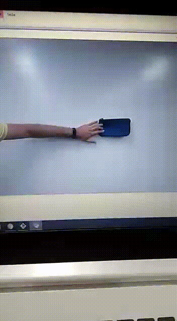

# Tracking de objetos com Opencv
Programa de tracking de objetos para a disciplina Sistemas Multimidias do curso de Ciência da Computação da UNICAP. 

## Instalações necessárias:
1 - OpenCv para python;

        $ pip install opencv-python

2 - Biblioteca numpy;

        $ pip install numpy

### Como executar (Abra o terminal e digite o comando):

1 - Usando vídeo (usando um arquivo de vídeo);

        $ python main.py <ARQUIVO_DE_VIDEO>

2 - Usando webcam (Executa o tracking em tempo real);

        $ python main.py

- Clique segure e arraste para iniciar o método de tracking do objeto

- Exemplo: 

